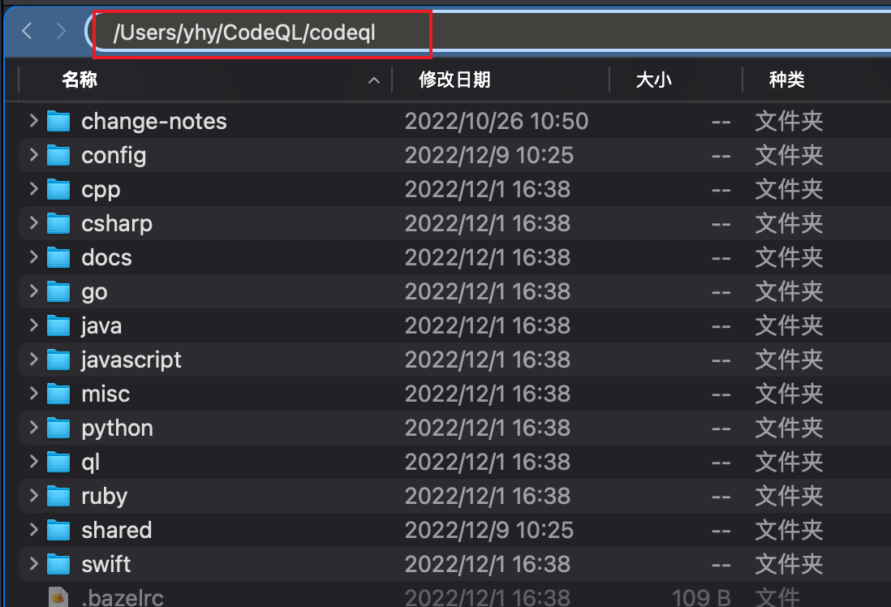
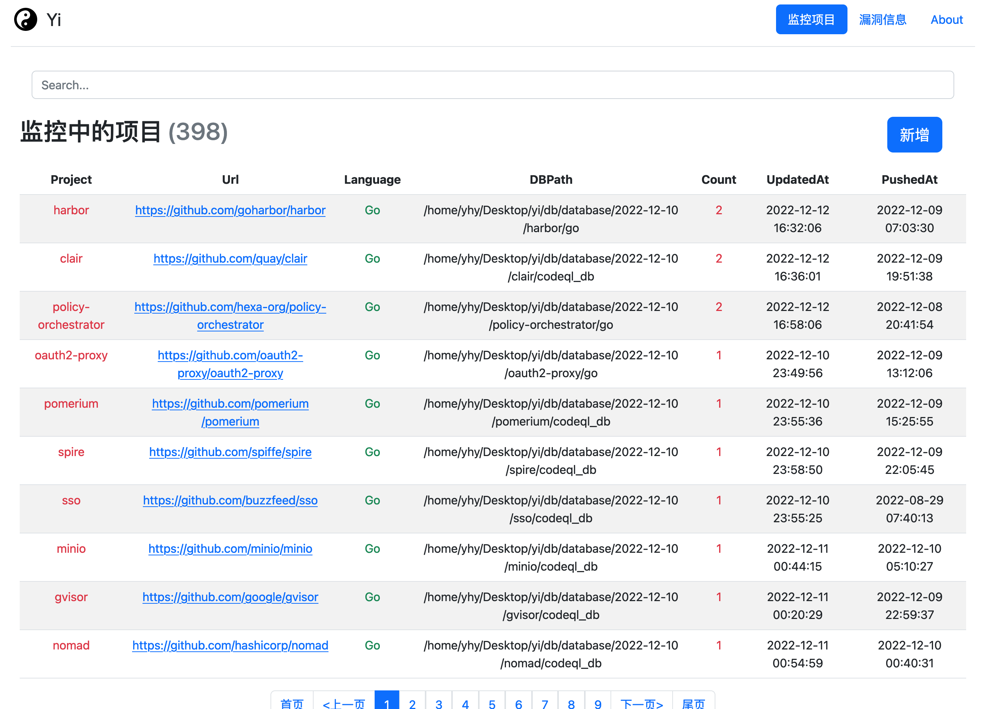
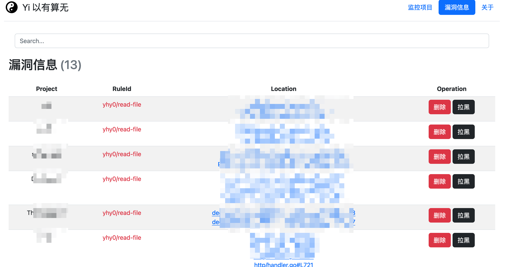

# 弈
以有算无

>   [lgtm](https://lgtm.com/) 要关闭了，就搞了一个自己的监控工具。也方便自己编写好规则后，自动化批量扫描, 高效捡洞。

每天检查 github 项目是否更新，自动获取/生成数据库查询,自动运行 CodeQL 规则查询,高效捡洞.

默认 web 页面开放在8888端口, 用户名，密码如果没有指定，用户名默认为 yhy, 密码为随机的，会输出到控制台

注：因为使用了 go-sqlite3,每个平台需要单独编译

```go
./Yi -token githubToken -pwd 密码 -f 1.txt -user 用户名 -path /Users/yhy/CodeQL/codeql
```

考虑到监控的项目有点多，所以需要 github token，防止访问被限制.

**-path** 必须要指定，指 codeql 各种语言规则库的顶级目录



其它参数

```go
-p 代理
-t 运行时监控一个项目
-f 运行后要监控的项目, 每行一个github项目地址 url
-port web 访问端口，默认 8888 端口
-thread 扫描协程数，默认 5 个

-t -f 指定一个即可，或者都不使用，通过 Web 界面的新增按钮，慢慢添加
```

运行后，会自动在当前目录下生成相关文件夹(下载、生成的数据库，clone的仓库)和 ql 规则配置文件。


注: 运行该程序的机器上要安装好 **Codeql**(加入环境变量)、**Git**、**Docker**、**Go**

**Java**、**Maven**、**Gradle**(如果要监控 Java 项目的话,不然会导致数据库生成失败)

如果你需要其他语言，修改代码后，最好也安装好语言对应的编译工具。 emmmm 有没有各种语言都安装好的 docker

还有就是最好使用 `root` 执行， 监控项目中使用 `makefile` 时，可能会有一些工具，机器上没有，导致数据库失败,比如:

```go
[2022-12-14 16:34:26] [build-stdout] INFO: yq was not found, installing it
[2022-12-14 16:34:30] [build-stderr] make: go: 权限不够
[2022-12-14 16:34:30] [build-stderr] make: go: 权限不够
```

# 安全隐患
`codeql` 生成数据库时，会执行项目下的类似`makefile`的构建流程，这里存在安全隐患。

所以一定要对 **可信** **可信** **可信** 的项目进行监控，**别被弹了 shell**。

**造成的一切损失与本项目及其作者无关**

**造成的一切损失与本项目及其作者无关**

**造成的一切损失与本项目及其作者无关**

# 功能





-   [x] 每天监控项目是否是否更新，更新则获取/生成数据库，进行 Codeql 扫描
-   [x] 监控配置文件更新，新增 ql 规则从数据库中获取进行扫描
-   [x] 黑名单，有的规则会误报，看的时候将该扫描结果拉黑，以后再次扫描时该结果就不会在界面显示


# TODO

-   [ ] 现在只是适配 Go,Java 语言，后期尽量适配主流语言,也可以修改项目中存在"Go","Java"的地方自己添加其他语言
-   [ ] codeql 创建数据库时 指定 --[no-]db-cluster 会自动创建所有语言的数据库, 如果不指定--language ，需要指定 github token 来 自动分析 --github-auth-stdin
-   [ ] 生成数据库可以下载
-   [ ] Docker 封装好各种语言及其编译工具
-   [ ] 读取本地 codeql 数据库，方便一些闭源或者私有项目

# 已知问题

-   [x] http 请求时，时不时的出现 `EOF` 解决方案：限制 github 访问速率


# 🌟 Star

[](https://starchart.cc/ZhuriLab/Yi)

# 📄 免责声明

本工具仅面向合法授权的企业安全建设行为，在使用本工具进行检测时，您应确保该行为符合当地的法律法规，并且已经取得了足够的授权。

如您在使用本工具的过程中存在任何非法行为或造成的一切损失，您需**自行承担相应后果, 本项目及其作者将不承担任何法律及连带责任**。

在使用本工具前，请您务必审慎阅读、充分理解各条款内容，限制、免责条款或者其他涉及您重大权益的条款可能会以加粗、加下划线等形式提示您重点注意。 除非您已充分阅读、完全理解并接受本协议所有条款，否则，请您不要使用本工具。您的使用行为或者您以其他任何明示或者默示方式表示接受本协议的，即视为您已阅读并同意本协议的约束。